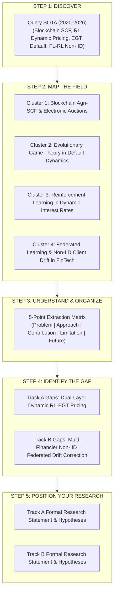
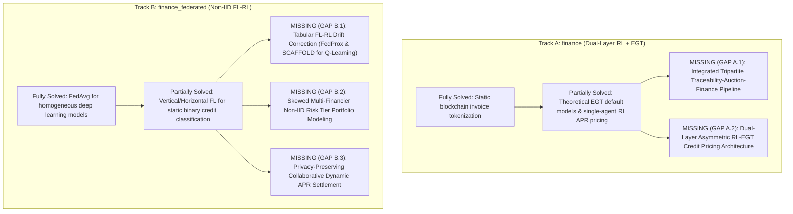

# Comprehensive Literature Survey & Research Gap Report: Supply Chain Finance Domain
**Focus Subfolders:** `finance` (Dual-Layer RL + EGT Framework) & `finance_federated` (Multi-Financier Federated Learning Framework)  
**Methodology:** 5-Step PhD Literature Survey Framework (*Discover $\rightarrow$ Map $\rightarrow$ Understand $\rightarrow$ Find Gap $\rightarrow$ Position*)  
**Date:** August 2026  

---

## Executive Summary

This report provides an in-depth literature survey and research gap formulation for the **Supply Chain Finance (SCF)** track of the PhD research program. Building upon the core principle (*"Do not collect papers. Build a map of human knowledge around your research question"*), this report investigates how decentralized blockchain ledgers, game-theoretic screening, reinforcement learning, and federated learning intersect to resolve post-auction liquidity crunches, farmer payment defaults, and borrower information asymmetry.

The domain is decoupled into two complementary sub-tracks:
1. **Track A (`finance`)**: **Dual-Layer Adaptive Credit Pricing (RL + EGT)**  
   Financier-side portfolio APR optimization via Reinforcement Learning coupled with wholesaler-side borrower screening via Evolutionary Game Theory (EGT) and localized RL risk premiums.
2. **Track B (`finance_federated`)**: **Privacy-Conscious Federated Trade Credit Modeling (FL-RL & Non-IID Aggregation)**  
   Multi-financier collaborative Q-learning across decentralized, non-identically distributed (Non-IID) borrower portfolios using FedAvg, FedProx, and tabular-adapted SCAFFOLD drift corrections.



---

# STEP 1 & 2: Discover & Map the Field

Through targeted academic retrieval (2020–2026) across Scopus, Web of Science, ScienceDirect, IEEE Xplore, and SSRN/arXiv, the literature in Blockchain Supply Chain Finance and Algorithmic Lending falls into **four distinct clusters**:

```mermaid
mindmap
  root((Supply Chain Finance Landscape))
    Cluster 1: Blockchain Agri-SCF & Auctions
      Foundational: Stiglitz & Weiss, Caniato et al., Reddy et al.
      Smart Contract SCF: Ye et al., Zhang et al., Li et al.
      Cash Crop Governance: Murugan et al., Acharya et al.
    Cluster 2: EGT & Credit Default Dynamics
      Tripartite Games: Wang et al., Chen et al.
      Penalty & Reward Mechanisms: Liu et al., Du et al.
      Accounts Receivable Financing: Zhou et al.
    Cluster 3: RL for Dynamic Interest Rate (APR) Pricing
      Portfolio Optimization: Moody & Saffell, Jiang et al.
      Q-Learning Lending: Kou et al., Jagannathan et al.
      Multi-Agent Dynamic Pricing: Varian et al.
    Cluster 4: Federated Learning & Non-IID FinTech
      Foundational FL: McMahan et al. (FedAvg)
      Heterogeneity & Drift: Li et al. (FedProx), Karimireddy et al. (SCAFFOLD)
      Collaborative Credit Scoring: Long et al., Zheng et al., Yang et al.
```

### Evolution of Supply Chain Finance Research
* **Phase 1: Static / Relational SCF (Pre-2018):** Relied on manual core-enterprise guarantees and fixed bank interest rates. High risk of invoice double-pledging and manual verification delays.
* **Phase 2: Blockchain-Automated SCF (2018–2022):** Introduction of Hyperledger Fabric and Ethereum smart contracts for invoice tokenization and automated escrow. Financing rates remained static, rule-based, or centrally administered.
* **Phase 3: AI-Driven & Privacy-Preserving Collaborative SCF (2023–2026):** Transition to adaptive, data-driven credit pricing using RL and EGT, combined with Federated Learning to overcome inter-bank data silos without violating strict financial privacy regulations.

---

# STEP 3: Understand & Organize (Structured Extraction Matrix)

Applying the standardized 5-point extraction schema (**Problem, Approach, Contribution, Limitation, Future Direction**) reveals key insights across seminal and recent works:

### Table 1: Systematic Extraction Matrix for Supply Chain Finance & FL

| Citation & Cluster | Problem Addressed | Proposed Approach | Key Contribution | Critical Limitation | Unresolved / Future Scope |
| :--- | :--- | :--- | :--- | :--- | :--- |
| **Caniato et al. (2019)**<br>*(SCF Principles)* | SME financing gap in multi-tier supply chains due to lack of credit history. | Supply Chain Finance taxonomy matching financial tools (factoring, reverse factoring) to supply chain archetypes. | Formalized how operational collaboration improves SME credit availability. | Qualitative and descriptive; no algorithmic pricing or automated smart contract execution. | Algorithmic, data-driven dynamic loan pricing. |
| **Zhang et al. (2024)**<br>*(Blockchain SCF)* | Double-pledging fraud and information silos between banks and suppliers. | Consortium blockchain platform on Hyperledger Fabric with tokenized accounts receivable. | Demonstrated tamper-proof invoice transfer across deep-tier suppliers. | Uses static, rule-based interest rates; cannot adapt to bank liquidity utilization or market volatility. | Dynamic interest rate adaptation based on real-time repayment signals. |
| **Wang et al. (2024)**<br>*(EGT in SCF)* | Default risk and strategic non-repayment in SME supply chain financing. | Tripartite Evolutionary Game Theory (EGT) model between commercial banks, core firms, and SMEs. | Established ESS (Evolutionarily Stable Strategies) and critical cost thresholds for default deterrence. | Theoretical differential equation model without integration into an operational ledger or live simulation testbed. | Operationalizing EGT scoring directly into smart contract credit gating. |
| **Kou et al. (2023)**<br>*(RL Lending)* | Inability of fixed APRs to maximize lender returns under shifting borrower demand. | Reinforcement Learning (Q-learning / DDPG) for dynamic loan interest rate pricing. | Proved RL outperforms static APRs in maximizing long-term portfolio yields. | Evaluated only on homogeneous consumer loan datasets; ignores supply-chain auction workflows and wholesaler inventory risks. | Hierarchical / dual-layer RL tailored for trade credit and inventory cycles. |
| **Li et al. (2020) [FedProx]**<br>*(Federated Learning)* | Client drift and divergence in federated optimization under Non-IID local data. | Added a proximal regularization term $\frac{\mu}{2}\|w - w^t\|^2$ to local loss functions. | Guaranteed convergence and stability across statistically heterogeneous clients. | Formulated exclusively for gradient-based deep neural networks; not adapted to discrete tabular Q-learning. | Adapting proximal concepts to tabular Q-learning environments. |
| **Karimireddy et al. (2020) [SCAFFOLD]**<br>*(Federated Learning)* | Severe gradient client drift in FedAvg when local data distributions diverge significantly. | Control-variate drift correction estimating client and server update directions. | Overcame client drift, proving linear speedup even under arbitrary non-IID partitions. | Designed for continuous parameter optimization in SGD; tabular reinforcement learning adaptations remain unstudied. | Tabular control-variate formulation for federated reinforcement learning. |
| **Zheng et al. (2025)**<br>*(FL Credit Scoring)* | Financial institutions cannot share raw SME credit records due to privacy regulations. | Vertical and Horizontal Federated Learning framework for inter-bank credit score card training. | Enabled cross-bank collaborative risk modeling without leaking raw client transaction records. | Focused on static binary classification (default vs. non-default); does not optimize dynamic interest rates or post-auction settlements. | Coupling federated risk modeling with sequential dynamic APR optimization. |

---

# STEP 4: Identify the Gap (Synthesis & Triangulation)

Triangulating the state of the art through the **"What is solved $\rightarrow$ What is partially solved $\rightarrow$ What is still missing"** framework yields decoupled research gaps for `finance` and `finance_federated`:



---

## 📌 Track A: `finance` (Dual-Layer RL + EGT Architecture)

### **Gap A.1: The Disconnection between Traceability, Dynamic Auctions, and Credit Liquidity**
* **Existing State:** Literature explores agricultural traceability ledgers or invoice-factoring platforms independently.
* **The Deficit:** In high-value cash crop auctions (like cardamom, where daily values exceed ₹4,500/kg and farmers require immediate settlement), auction outcomes are completely disconnected from working capital disbursement. Wholesalers face liquidity shortfalls, while financiers lack real-time visibility into winning bid allocations, lot quality grades, or packet sales. No unified system exists that **interlocks on-chain auction bid acceptance with automated, smart-contract-disbursed trade credit and split-payment repayments from downstream sales**.

### **Gap A.2: Static vs. Dual-Layer Asymmetric Credit Pricing Gap**
* **Existing State:** Existing blockchain-SCF models employ fixed interest rates or single-agent heuristics that treat loan pricing as a one-dimensional problem.
* **The Deficit:** SCF lending is inherently asymmetric:
  1. *The Financier* must optimize **macro-level portfolio yield** based on capital utilization ($<33\%$, $33\%-66\%$, $>66\%$) and available liquidity.
  2. *The Wholesaler/Borrower* presents **micro-level behavioral default risk** based on historical margins, repayment discipline, and market shocks.
  Existing literature lacks a **dual-layer decision framework** where a Financier RL agent sets the Base APR and an Evolutionary Game Theory (EGT) / borrower RL policy computes dynamic risk premiums ($\Delta \text{APR} = \text{Base}_{\text{RL}} + \text{Premium}_{\text{EGT/RL}}$) to simultaneously maximize capital growth and suppress default probability.

---

## 📌 Track B: `finance_federated` (Non-IID Federated Learning & Drift Correction)

### **Gap B.1: Tabular Q-Learning Adaptation Gap for Advanced FL Aggregations (FedProx & SCAFFOLD)**
* **Existing State:** Advanced federated optimization algorithms like FedProx and SCAFFOLD were developed strictly for continuous parameter spaces in stochastic gradient descent (SGD) deep neural networks.
* **The Deficit:** High-stakes FinTech and trade credit environments frequently require transparent, auditable, and interpretable policy structures (e.g., discrete tabular Q-learning risk-premium matrices). Literature has **not formulated or validated tabular adaptations of proximal terms (FedProx) or control-variate drift corrections (SCAFFOLD) for temporal difference (TD) Q-table updates**, leaving tabular RL susceptible to severe client drift under heterogeneous local data.

### **Gap B.2: Skewed Multi-Financier Portfolio Heterogeneity (Non-IID Risk Tiers)**
* **Existing State:** Multi-agent blockchain finance simulations assume homogeneous borrower pools uniformly distributed across lenders.
* **The Deficit:** In actual agricultural trading clusters, competing financiers specialize in distinct market segments (e.g., Financier A funds premium export wholesalers, Financier B funds volatile local aggregators, Financier C funds distressed smallholders). Under such **statistically non-identical (Non-IID) risk-tier partitions**, standard uniform averaging (`FedAvg`) drifts toward suboptimal compromise policies that fit no single lender. There is no empirical research analyzing **how proximal and control-variate federated algorithms outperform FedAvg across varying capital allocations ($1\text{M}, 5\text{M}, 10\text{M}$), random seeds, and default shock intensities**.

### **Gap B.3: Privacy-Preserving Collaborative Lending without Raw History Centralization**
* **Existing State:** Credit rating agencies require pooling raw bank account records, financial statements, and borrower identities, creating severe antitrust, regulatory, and competitive barriers.
* **The Deficit:** There is a lack of an **end-to-end privacy-conscious collaborative finance architecture** where decentralized financiers locally retain all sensitive transaction logs, default instances, and borrower identities—collaborating exclusively through periodic, encrypted Q-table update aggregation to enhance global screening power.

---

# STEP 5: Position Your Research

Connecting the literature synthesis directly to your dissertation and papers yields the formal research positioning statements:

### Table 2: Research Positioning & Thesis Chapter Alignment

| Subfolder Track | Formal Research Statement | Key Tested Hypotheses | Primary Dissertation Chapter | Target Publication Venue |
| :--- | :--- | :--- | :--- | :--- |
| **`finance` (RL + EGT)** | *"My research focuses on **an adaptive, dual-layer blockchain supply chain finance architecture combining financier RL APR optimization with borrower EGT screening** because existing approaches **rely on static credit terms and treat traceability and financing as disjoint modules**, but still lack **a closed-loop mechanism that dynamically prices credit based on macro capital utilization and suppresses default risk through game-theoretic behavioral scoring**."* | **$H_1$**: A dual-layer `RL + EGT` policy generates significantly higher net capital return and lower default rates compared to fixed APR baselines across varied capital levels ($0.5\text{M} - 5\text{M}$).<br>**$H_2$**: Smart-contract-enforced automated split repayments eliminate discretionary payment delays between wholesalers and farmers. | **Chapter 6** (*Adaptive Supply Chain Finance with RL and EGT*) | *International Journal of Production Economics* / *Computers & Industrial Engineering* |
| **`finance_federated` (FL-RL)** | *"My research focuses on **privacy-conscious federated reinforcement learning for supply chain credit scoring under non-IID borrower heterogeneity** because existing federated finance solutions **focus on static classification and assume homogeneous client data**, but still lack **the capability to prevent client drift in tabular Q-learning across competing financiers with skewed risk portfolios using FedProx and SCAFFOLD drift corrections**."* | **$H_3$**: Under non-IID risk-tier partitioning, tabular-adapted FedProx and SCAFFOLD significantly outperform standard FedAvg in final capital accumulation and default prevention.<br>**$H_4$**: Federated RL borrower screening improves localized loan profitability without requiring inter-bank sharing of raw customer identities or transaction histories. | **Chapter 6 / Journal Manuscript** (*Adaptive Supply Chain Finance under Fragmented Borrower Information: Federated Learning Evidence*) | *European Journal of Operational Research* / *IEEE Transactions on Computational Social Systems* / *Managerial Finance* |

---

# Strategic Recommendations for Manuscript & Code Experiments

1. **For the Core Finance Manuscript (`finance/manuscript`)**:
   * Frame Section 1 & 2 around the **Tripartite Closed Loop**: Traceability $\rightarrow$ Auction Price Discovery $\rightarrow$ Smart Credit Disbursement $\rightarrow$ Automated Repayment.
   * Highlight the Phase A (EGT parameter optimization: $\alpha=0.30, \eta=200$) vs. Phase B (RL parameter optimization: $\alpha=0.25, \gamma=0.95$) decoupled tuning methodology to prove structural rigor.

2. **For the Federated Finance Manuscript (`finance_federated/manuscript`)**:
   * Emphasize the novel **tabular adaptation of SCAFFOLD and FedProx** for Q-learning as a major algorithmic contribution for distributed FinTech systems.
   * Highlight the Non-IID borrower allocation matrix (`assign_non_iid_borrower_segments`), demonstrating that the superiority of FedProx/SCAFFOLD is directly revealed when client portfolios diverge in real-world risk distributions.
